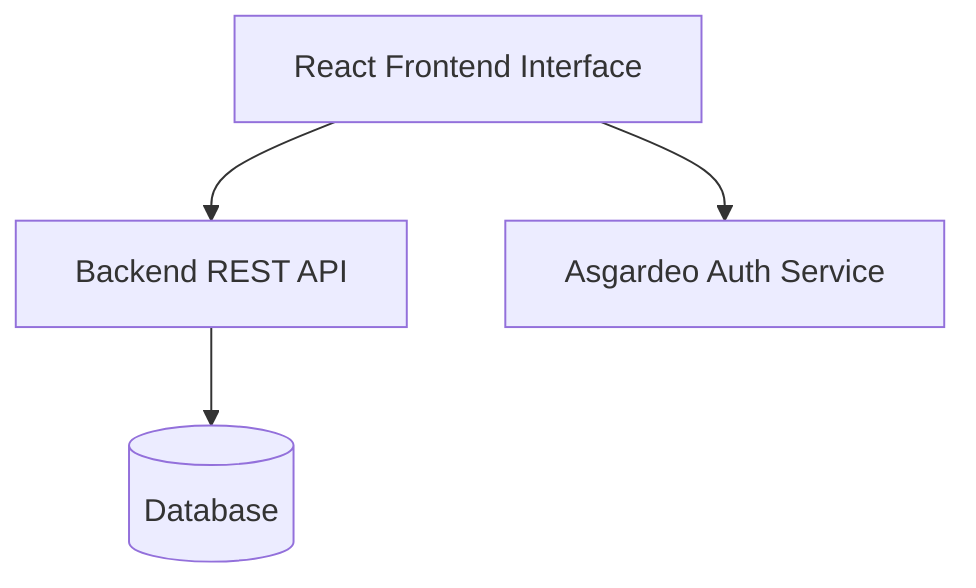
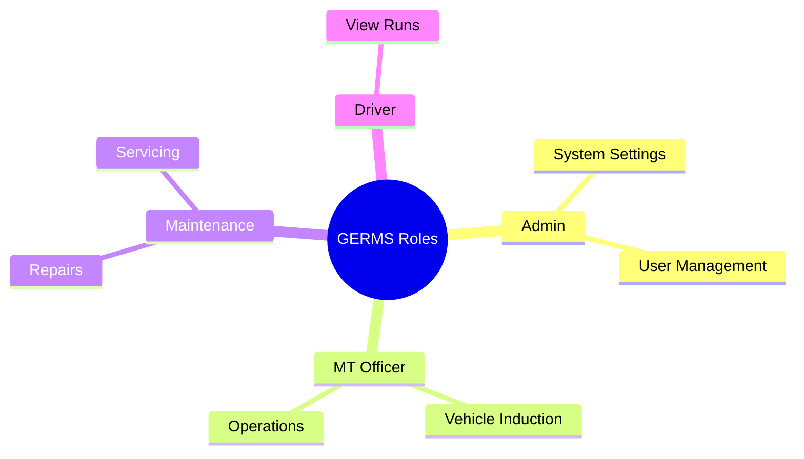
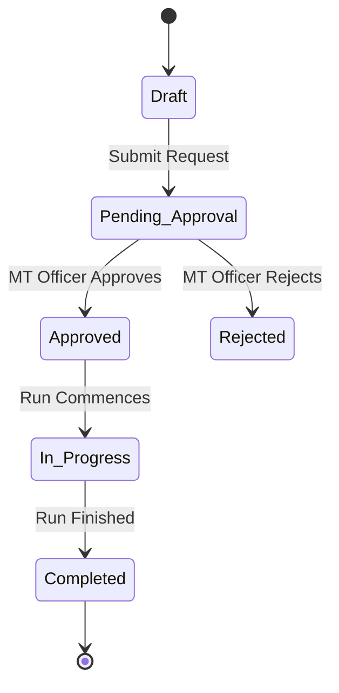

# Software Requirements Specification (SRS) for GERMS (Ground Equipment Resource Management System)

## 1. Introduction

### 1.1 Purpose
The purpose of this document is to specify the software requirements for the GERMS FrontEnd application. This application serves as a comprehensive Motor Transport (MT) and ground equipment management dashboard, primarily designed for military/air force operational environments. 

### 1.2 Scope
GERMS manages the lifecycle of vehicles and ground equipment from induction to maintenance, operations, and reporting. The system allows users to track vehicle allocations, schedule and log maintenance/servicing, manage transport operations (including forms like E-658 for Short and Long Runs), and administer user roles and permissions.

### 1.3 Definitions, Acronyms, and Abbreviations
- **GERMS**: Ground Equipment Resource Management System (inferred context).
- **MT**: Motor Transport.
- **SLAF**: Sri Lanka Air Force (inferred context).
- **E-658**: Standard form for authorizing and tracking vehicle runs (Short Run, Long Run, RR).
- **UOMTM**: Unit Officer Motor Transport Management (inferred context).
- **MTM**: Motor Transport Mechanic / Management.

## 2. Overall Description

### 2.1 Product Perspective
GERMS FrontEnd is a web-based React application built upon the TailAdmin dashboard template, utilizing Vite, TypeScript, and Tailwind CSS. It communicates with a backend REST API to persist data.

### 2.2 User Characteristics
- **Admin**: Has full access to Settings, User Management, and Role Management.
- **MT Officer**: Manages MT Operations, Induction, and Vehicle Allocation.
- **Maintenance Supervisor / MTM**: Manages servicing, repairs, and UOMTM records.
- **General User / Driver**: Views assignments and E-658 run authorizations.

### 2.3 Operating Environment
The frontend is a responsive web application designed to run on modern web browsers (Chrome, Firefox, Safari, Edge).

## 3. System Features (Functional Requirements)

### 3.1 Induction Module
The system shall allow authorized users to manage the induction of new vehicles into the fleet.
- **Vehicle Induction:** Register new vehicles into the system.
- **Add Vehicle Model:** Define new makes/models of vehicles.
- **Register to Air Force:** Assign specific military identification/registration numbers to vehicles.
- **Vehicle Allocation:** Allocate registered vehicles to specific units, bases, or personnel.

### 3.2 Maintenance Module
The system shall manage the servicing and repair lifecycle of the fleet.
- **Servicing:** Log and schedule routine vehicle servicing.
- **Service Rules:** Define parameters and intervals (e.g., mileage or time-based) for vehicle servicing.
- **Repairs & Accident Repairs:** Log mechanical breakdowns and accident-related repairs, tracking status and costs.
- **UOMTMs & MTM Registration:** Manage records related to Motor Transport maintenance personnel and units.

### 3.3 MT Operations
The system shall provide a dashboard to manage daily Motor Transport operations, such as dispatching vehicles and monitoring fleet availability.

### 3.4 E-658 Management
The system shall digitize the E-658 vehicle run authorization process.
- **Short Run:** Create, approve, and track E-658 forms for short-distance trips.
- **Long Run:** Create, approve, and track E-658 forms for long-distance/overnight trips.
- **RR:** Manage specific E-658 requirements related to RR (e.g., Routine Runs or specific military transport classifications).

### 3.5 Reports
The system shall generate comprehensive reports on:
- Fleet status and availability.
- Maintenance history and upcoming servicing schedules.
- MT operational statistics.

### 3.6 User & Role Management
- **User Management:** Create, update, deactivate, and view user profiles.
- **Role Management & Permissions:** Define custom roles and assign granular permissions to access specific modules.

### 3.7 Settings & Page Maintenance
The system shall provide an administrative interface to configure system-wide parameters and handle site maintenance tasks.

## 4. Non-Functional Requirements

### 4.1 Performance
- The application shall load pages within 2 seconds under normal network conditions.
- The UI shall remain responsive and utilize efficient state management (React hooks).

### 4.2 Security
- The system shall implement secure authentication (JWT or equivalent via `@asgardeo/auth-react`).
- Route protection shall be enforced, redirecting unauthorized users.

### 4.3 Usability and UI/UX
- The application shall use the TailAdmin template to provide a modern, clean, and consistent user interface.
- It shall support a Dark Mode toggle.
- It shall be fully responsive, ensuring usability on tablets and desktops.

## 5. System Interfaces

### 5.1 User Interfaces
- Built with React 19, TypeScript, and Tailwind CSS v4.
- Utilizes components such as ApexCharts for data visualization, FullCalendar for scheduling, and Flatpickr for date selection.

### 5.2 Software Interfaces
- **Backend API:** The frontend will communicate via RESTful APIs using `axios` for CRUD operations on all entities (Vehicles, Users, Maintenance logs, E-658 forms).
- **Authentication Provider:** Integration with Asgardeo (`@asgardeo/auth-react`) for identity and access management.
